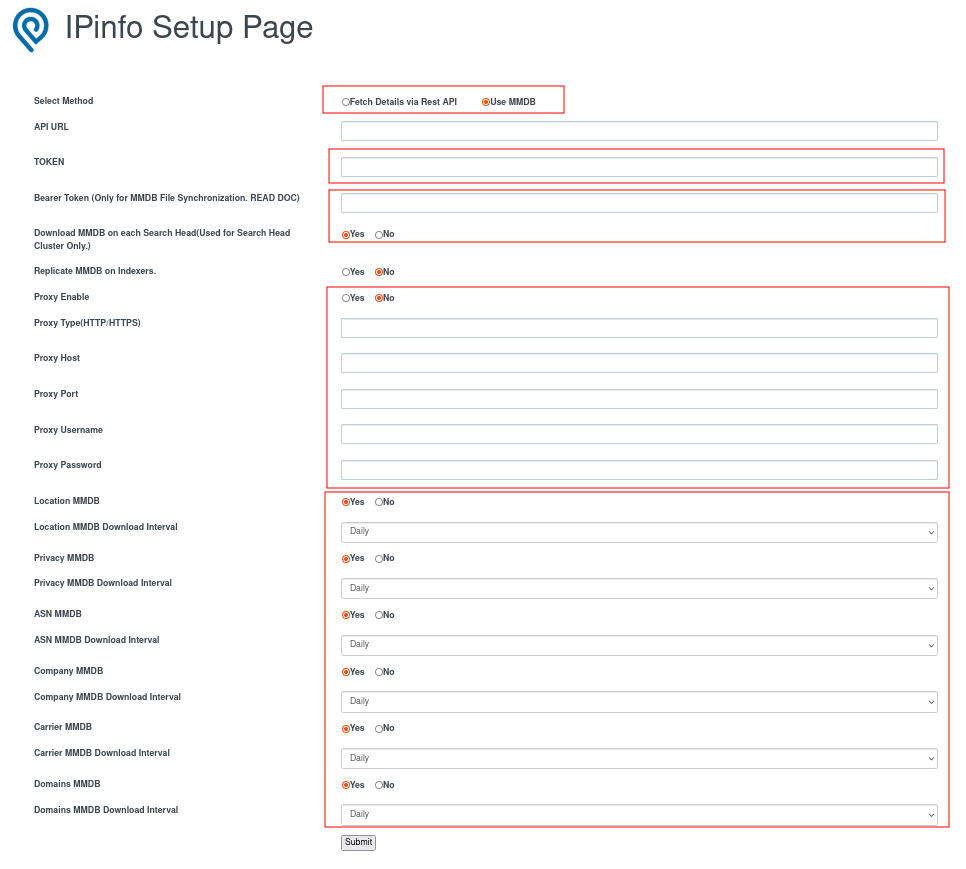
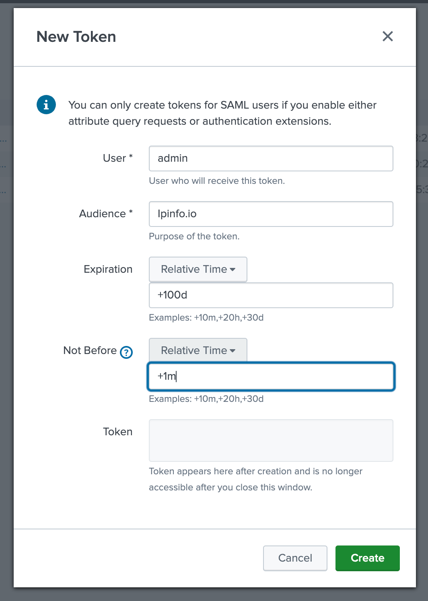
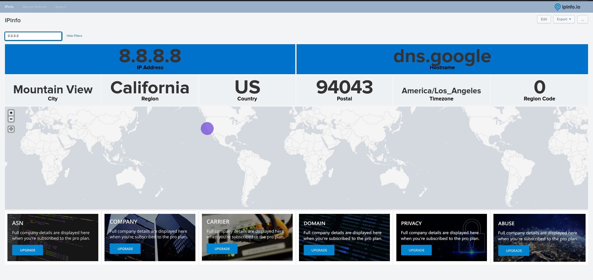
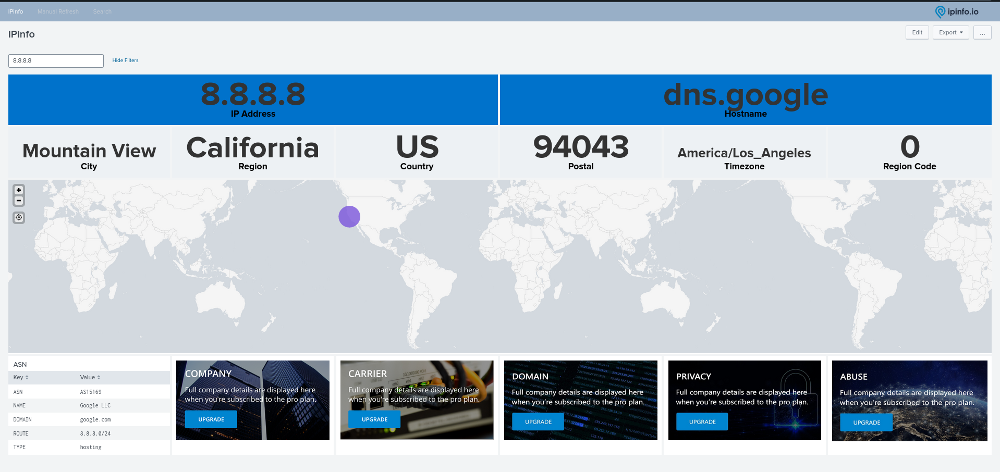
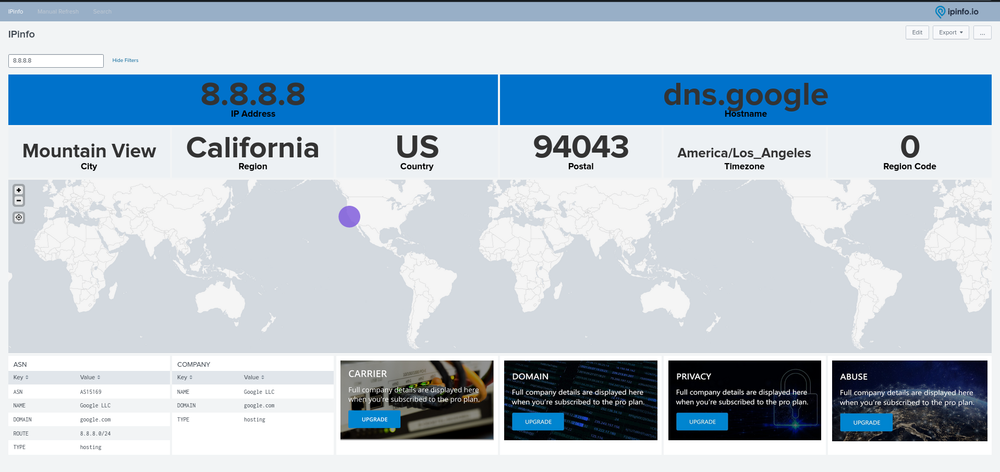
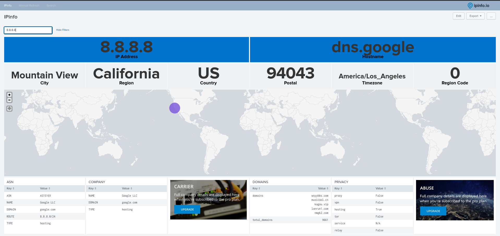
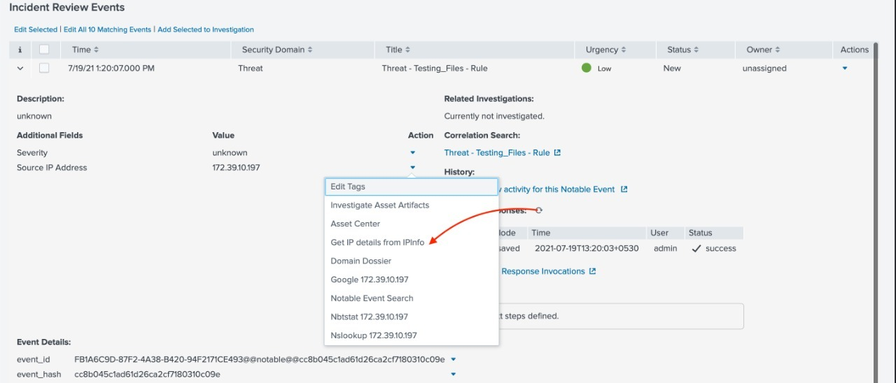

# IPinfo Splunk App Installation & Configuration

**App Version**: 8.6.0 (see [CHANGELOG](./CHANGELOG.md))

**Author**: IPinfo

**Description**: Installation and Configuration Document for IPInfo App for Splunk

**Latest Update Date**: Nov 7 2023

# Supported OSes

All Splunk supported OS (Windows, Linux, Mac)

Ref: [https://www.splunk.com/en_us/download/splunk-enterprise.html](https://www.splunk.com/en_us/download/splunk-enterprise.html)

# Supported Splunk Version

| Splunk |
| --- |
| Splunk 9.0.X |
| Splunk 9.1.X |

# Introduction

The IPinfo app provides an integration between IPinfo’s API & DB products and Splunk. This app adds the `ipinfo` command to Splunk, which uses IPinfo data via the API or DBs to lookup IP information for a given IP address.

# Installation

**NOTE**: There are multiple ways of deploying apps to Splunk environment, in this document we’ll be referring installation via CLI (Command Line Interface)

## Case 1: Single Stand Alone Machine (CLI)

Single standalone Splunk Enterprise Installation on Windows/*NIX


1. **Unzip ipinfo_app.spl**
2. **Copy** the unzipped directory **ipinfo_app** to **$SPLUNK_HOME/etc/apps/**
3. **Open CLI** and restart Splunk using **./splunk restart**

## Case 2: Distributed Architecture

Single Indexer Single Search head and Single forwarder (Heavy or Universal) and Deployment server


1. **Unzip ipinfo_app.spl**
2. **Copy** the unzipped directory **ipinfo_app** to deployment server in the following location
    
    **$SPLUNK_HOME/etc/deployment-apps/**
    
3. Add following to **serverclass.conf**
    
    ```
    [serverClass:<SEARCHHEAD_SERVERCLASS>:app:< ipinfo_app >]
    stateOnClient=enabled
    restartSplunkd=true
    ```
    
4. **Open CLI** deploy the apps using following command **./splunk reload deploy-server**

## Case 3: Distributed Architecture

Multiple non-clustered Indexers, Multiple non-clustered SearchHeads, Forwarder(Heavy or Universal) and Deployment server


1. **Unzip ipinfo_app.spl**
2. **Copy** the unzipped directory **ipinfo_app** to deployment server in the following location **$SPLUNK_HOME/etc/deployment-apps/**
3. Add following to **serverclass.conf**

    ```
    [serverClass:<SEARCHHEAD_SERVERCLASS>:app:< ipinfo_app >]
    stateOnClient=enabled
    restartSplunkd=true
    ```

4. **Open CLI** deploy the apps using following command **./splunk reload deploy-server**

## Case 4: Distributed Architecture

Single Site clustered Indexer, Clustered Search heads and Forwarder (Heavy or Universal).


1. **Unzip ipinfo_app.spl**
2. **Copy** **ipinfo_app** to Deployer server in the following location **$SPLUNK_HOME/etc/shcluster/apps/**
3. **Open CLI** on Deployer and deploy the app on Search Head Cluster using following command
    
    ```
    ./splunk apply shcluster-bundle -target <URI>:<management_port> -auth
    
    <username>:<password>
    ```
    

## Case 5: Standalone Installation (WEB)

1. On the Splunk Home Page, Click on “Manage”
    

    
2. On the Manage Apps page, Click on “Install app from file”
    

    
3. Select path for IPINFO Splunk app .spl file and Click “Upload”
    

    
4. It is good practice to restart the Splunk, please restart

# Configuration

1. After Installation and restart, login to the Splunk web and go to ‘Manage’
2. It will list out all the installed application and their configuration option.
3. Look for ‘IPINFO and click on the ‘Set-Up’ link to configure the add on.


## API Configuration

When configuring the "Rest API" option, the TOKEN field is mandatory, serving as a crucial authentication element for accessing API resources. In contrast, all proxy-related fields are optional, providing flexibility for users who may or may not require proxy settings.


## MMDB Configuration

When configuring the `MMDB` option:

- **TOKEN** and **MMDB** related fields will be mandatory fields
- Bearer Token is optional. But it will be used when trying to download MMDB using **Manual Refresh** Dashboard and/or using “**Download MMDB on Each Search Head**” as “**No”**.
- Set “**Download MMDB on Each Search Head**” as “**No**” used when there is a search head cluster and you want to download MMDB from ipinfo.io on only one Search and sync on other search heads and in this case Bearer token is compulsory. And set “**Yes**” when you each Search Head to Download MMDB from IPinfo.io. Recommended “**Yes**”
- All Proxy related fields will be optional fields
- **Bearer Token** and “**Download MMDB on Each Search Head**” will not use for Standalone Search Head.
    

    
**NOTE**: MMDB is downloaded in /lookups section of app directory. And does not overwrite splunk’s default MMDB.

### **Pro configurations**


**NOTE**: Do not change the default settings in above section on setup page, unless you know what you are upto.

### **Replicate MMDB on Indexers**

When enabled **YES** will enable replication on MMDB bundle and also make bunch of changes in the code that will enable *ipinfo* to work in streaming more. This is expected to cause performance boost on the query at the expense on increase in bundle size.

This setting is applicable if you using ipinfo app on splunk search head cluster and you have indexer cluster.

### **Download MMDB on each Search Head**

When disabled **NO** will need bearer token to be generated (refer next page) for one search head to download the MMDB files and then replicate on all the other searchheads automatically. This will reduce internet consumption by few gigs while downloading MMDB.

This setting is applicable if you using ipinfo app on splunk search head cluster

### **Steps to get Bearer Token**

1. Go to Settings -> Tokens
2. Click on “New Token” and provide necessary information. And when you click on Create. You will get token value. Just copy that and give as Bearer token in IPinfo.



# Usage


## Fields

| Data Type | Fields Included |
| --- | --- |
| Location | ip, city, region, country, loc, org, postal, hostname |
| ASN | asn_asn, asn_name, asn_domain, asn_route, asn_type |
| Company | company_name, company_domain, company_type |
| Carrier | carrier_name, carrier_mcc, carrier_mnc |
| Privacy | vpn, proxy, tor, hosting, relay, service |
| Domains |  total_domains, domains |
| Abuse | abuse_address, abuse_country, abuse_name, abuse_email, abuse_network, abuse_phone |

## Examples

**NOTE**: You can add two or more flags in single search query.

```
| makeresults 1 
| eval IP1=random()%192, IP2=random()%210, IP3=random()%230, IP4=random()%192, IP='IP1'.".".'IP2'.".".'IP3'.".".'IP4'
| table _time IP 
| ipinfo IP
```

### `ipinfo`

```
| makeresults count=2000
| eval IP1=random()%192, IP2=random()%210, IP3=random()%230, IP4=random()%192, IP='IP1'.".".'IP2'.".".'IP3'.".".'IP4'
| table _time IP
| ipinfo IP
```

### `ipinfo` (Multi)

```
| makeresults count=100
| eval IP1=random()%192, IP2=random()%210, IP3=random()%230, IP4=random()%192, SRCIP='IP1'.".".'IP2'.".".'IP3'.".".'IP4'
| eval IP1=random()%192, IP2=random()%210, IP3=random()%230, IP4=random()%192, DESTIP='IP1'.".".'IP2'.".".'IP3'.".".'IP4'
| table _time SRCIP DESTIP
| ipinfo SRCIP DESTIP
```

### `ipinfo` (prefix)

```
| makeresults count=100
| eval IP1=random()%192, IP2=random()%210, IP3=random()%230, IP4=random()%192, SRCIP='IP1'.".".'IP2'.".".'IP3'.".".'IP4'
| table _time SRCIP
| ipinfo prefix=true SRCIP
```

### `ipinfo` (privacy)

```
| makeresults 
| eval IP="8.8.8.8"
| ipinfo IP privacy=true
```

### `ipinfo` (asn)

```
| makeresults 
| eval IP="8.8.8.8"
| ipinfo IP asn=true
```

### `ipinfo` (company)

```
| makeresults 
| eval IP="8.8.8.8"
| ipinfo IP company=true
```

### `ipinfo` (abuse)

```
| makeresults 
| eval IP="8.8.8.8"
| ipinfo IP abuse=true
```

### `ipinfo` (domains)

```
| makeresults 
| eval IP="8.8.8.8"
| ipinfo IP domains=true
```

### `ipinfo` (carrier)

```
| makeresults 
| eval IP="1.0.178.0"
| ipinfo IP carrier=true
```

### `ipinfo` (alltypes)

```
| makeresults 
| eval IP="1.0.178.0"
| ipinfo IP alltypes=true
```

### `ipinfobatch`

```
| ipinfobatch ip="197.94.71.228
,197.94.71.227
,197.94.71.221
,197.94.71.226
,197.94.71.225
,197.94.71.22"
```

### `privacyinfo`

```
| makeresults 
| eval IP="23.24.240.0" 
| privacyinfo IP
```

### `rangeinfo`

```
| makeresults 
| eval domain="comcast.net" 
| rangeinfo domain
```

### `domaininfo`

```
| makeresults 
| eval IP="1.1.1.1" 
| domaininfo IP
```

## Dashboard

**NOTE**: In instances where subscription data is unavailable for a particular IP or if no subscription is present, an upgrade image will be displayed.

### Location Details Dashboard View



### ASN Details Dashboard View



### Company Details Dashboard View



### Domain Details Dashboard View


### Privacy Details Dashboard View



### Abuse Details Dashboard View


### Carrier Details Dashboard View


## Workflow Action

From version 5.3.1, we have added a new workflow actions in Splunk which will give you option to fetch details of IP from IPInfo by single click. It will work when fieldname is **ip OR *_ip** like **ip,dest_ip,src_ip** etc**.**

### Example




