# Splunk Installation & Configuration

# IPInfo App for Splunk

**App Version**: 8.6.0

**Author**: IPinfo

**Description**: Installation and Configuration Document for IPInfo App for Splunk

**Latest Update Date**: Nov 7 2023

# Version Summary

| Version | Change History |
| --- | --- |
| 1.0.0 | -Initial Version |
| 1.0.2 | -Added Screenshots and Web Installation Steps |
| 1.0.3 | -Replace old dashboard screen with new |
| 1.0.7 | -Bug Fixes
-Color Issues |
| 3.0.0 | -Support to Splunk 8.x and Python 3.x |
|  | -Internal Updates |
| 3.4.9 | -New scripted lookup
-New ipinfobatch command |
| 3.4.11 | -Bug Fixes and Compliance to Splunk App Inspect |
| 3.5.3 | -Added Support for New Lookup Commands.
  privacyinfolookup 
  domaininfolookup
  rangesinfolookup |
| 3.5.4 | -Bugfixes : Issues with ipinfolookup command |
| 4.0.0 | -IPInfo not supported on Splunk 6.x and 7.x |
| 4.0.9 | -Support for Proxy Settings |
| 5.0.2 | -Support for Splunk Search Head Cluster |
| 5.1.1 | -Merging ipinfolookup capability with original ipinfo command
   privacyinfolookup to now be privacyinfo
   domaininfolookup to now be domaininfo
   rangesinfolookup to now be rangesinfo |
| 5.1.2 | -Updating `ipinfo` command to support ipinfo bulk api |
| 5.2.8 | -Feature to Add custom rootCA certificate.
-Feature to Disable the SSL verification.
-Couple of other Bug fixes. |
| 5.2.10 | -Updating Python Library to 1.6.15
-Bug Fixes with Batch Command |
| 5.3.1 | -Adding WorkFlow Action for IPinfo |
| 5.4.0 | -Support batching in privacy command |
| 5.4.1 | -Cleaning Up of Old Splunk Code and Minor Bug Fixes |
| 5.4.2 | -Introducing lat/lon along with loc, for better support with maps |
| 5.4.3 | -Adding prefix=true support with ipinfo command |
| 5.5.0 | -Multi IP support with ipinfo command (eg |ipinfo src_ip dest_ip) |
| 5.5.1 | -Adding a privacy=true flag so that the results are returned as part of the ipinfo command and other Minor Bug Fixes |
| 5.6.1 | -Adding a privacy=true flag so that the results are returned as part of the ipinfo command
Support for multiple fields in one go , for example | ipinfo prefix=true src_ip, dest_ip |
| 5.6.2 | -Minor BugFixes with commands |
| 5.6.3 | -Minor BugFixes with setup page |
| 5.7.3 | -Support for Authenticated Proxy
-Splunk Cloud Compatibility Package |
| 5.7.4 | -Bug Fixes with Authenticated Proxy
-Splunk Cloud Compatibility Package |
| 6.0.1 | -Updates to ipinfobatch command output
-New options available for ipinfo command
-Minor Bug fixes |
| 7.0.7 | -NEW Setup Page for MMDB
-Support for all commands using MMDB and API
-Bugfix related to NULL values with ipinfo command
-Bugfix on issues with unauthenticated Proxy
-Other Minor BugFixes |
| 7.0.8 | -Bugfix multiple API calls or single IP lookup using ipinfo command
-Other Minor BugFixes |
| 7.1.1 | -Persistent Setup Page
-Updated MMDB section on Setup Page
-Enhancement where MMDB is supported automatically on non-default management port.
-Other Minor BugFixes |
| 8.0.0 | -Fix MMBD Bundle Accumulation Issues (old bundle gets deleted as new -MMDB bundle is downloaded)
-Fix ipinfo command to work in MMDB mode to work without "list_storage_password" capability.
-Other Minor BugFixes- |
| 8.1.0 | -New Feature Manual Trigger to Sync the MMDB
-Fix IPV6 IP returning results on the Dashboard
-Disabled Replication to Indexing Layer
-Other Minor BugFixes |
| 8.2.0 | -New Feature Option to Parallel download MMDB or Download once and sync later.
-Other minor bug fixes |
| 8.3.1 | -Performance Boost on MMDB Read
-Update on Default Dashboard
-Other minor bug fixes |
| 8.4.0 | -Support for streaming (only with mmdb)
-Other minor bug fixes. |
| 8.5.1 | -Cloud compatibility fix was made.
-Fixed a bug where carrier data was not showing if company data is not available.
-Fixed a bug where on Windows machines the setup page produced a configuration file that was encoded as UTF-8-BOM, which the app was unable to open.
-Added support for standard_ip_hosted_domains.mmdb |
| 8.6.0 | -Upgraded Splunk SDK version from 1.6.16 to 1.7.4.
-Stopped support for Splunk version 8.x.
-Fixed an issue where a default value for replicate_lookup was not provided in the custom app configuration files.
-Fixed an issue where the proxy type was incorrectly being propagated if entered as uppercase (e.g. 'HTTP') instead of lowercase (e.g. 'http'). This caused proxy setups to fail to properly make HTTP requests.
-Fixed an issue where MMDB files weren't being downloaded in distributed setups properly due to the way in which the API token was being retrieved in such a setup.
-Removed usage of replicationBlacklist and replicationWhitelist, which were deprecated in 9.x. Now use replicationAllowlist and replicationDenylist. |

# Supported OS

All Splunk supported OS (Windows, Linux, Mac)

Ref: [https://www.splunk.com/en_us/download/splunk-enterprise.html](https://www.splunk.com/en_us/download/splunk-enterprise.html)

# Supported Splunk

| Splunk |
| --- |
| Splunk 9.0.X |
| Splunk 9.1.X |

# IPInfo App for Splunk

IPInfo App for Splunk provides an Integration between IPInfo API and Splunk. This app adds *ipinfo* command to Splunk, which uses IPINFO API engine to lookup information for a given IP. MMDB Download is also available and supports all features of *ipinfo* command.

NOTE: MMDB is downloaded in /lookups section of app directory. And does not overwrite splunk’s default MMDB.

# Install the App

**NOTE**: There are multiple ways of deploying apps to Splunk environment, in this document we’ll be referring installation via CLI (Command Line Interface)

## Case 1: Single Stand Alone Machine (CLI)

Single standalone Splunk Enterprise Installation on Windows/*NIX


1. **Unzip ipinfo_app.spl**
2. **Copy** the unzipped directory **ipinfo_app** to **$SPLUNK_HOME/etc/apps/**
3. **Open CLI** and restart Splunk using **./splunk restart**

## Case 2: Distributed Architecture

Single Indexer Single Search head and Single forwarder (Heavy or Universal) and Deployment server


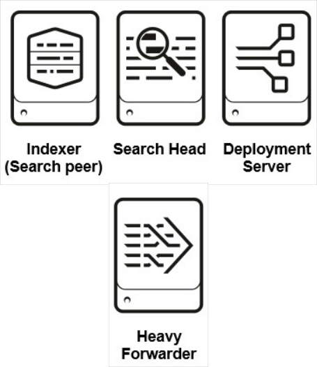

1. **Unzip ipinfo_app.spl**
2. **Copy** the unzipped directory **ipinfo_app** to deployment server in the following location
    
    **$SPLUNK_HOME/etc/deployment-apps/**
    
3. Add following to **serverclass.conf**
    
    [serverClass:<SEARCHHEAD_SERVERCLASS>:app:< ipinfo_app > ] stateOnClient=enabled restartSplunkd=true
    
4. **Open CLI** deploy the apps using following command **./splunk reload deploy-server**

## Case 3: Distributed Architecture

Multiple non-clustered Indexers, Multiple non-clustered SearchHeads, Forwarder(Heavy or Universal) and Deployment server


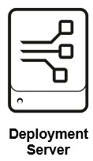


1. **Unzip ipinfo_app.spl**
2. **Copy** the unzipped directory **ipinfo_app** to deployment server in the following location **$SPLUNK_HOME/etc/deployment-apps/**
3. Add following to **serverclass.conf**
    
    [serverClass:<SEARCHHEAD_SERVERCLASS>:app:< ipinfo_app >] stateOnClient=enabled restartSplunkd=true
    
4. **Open CLI** deploy the apps using following command **./splunk reload deploy-server**

## Case 4: Distributed Architecture

Single Site clustered Indexer, Clustered Search heads and Forwarder (Heavy or Universal).


1. **Unzip ipinfo_app.spl**
2. **Copy** **ipinfo_app** to Deployer server in the following location **$SPLUNK_HOME/etc/shcluster/apps/**
3. **Open CLI** on Deployer and deploy the app on Search Head Cluster using following command
    
    **./splunk apply shcluster-bundle -target <URI>:<management_port> -auth**
    
    **<username>:<password>**
    

## Case 5: Standalone Installation (WEB)

1. On the Splunk Home Page, Click on “Manage”
    
    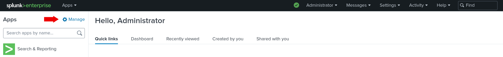
    
2. On the Manage Apps page, Click on “Install app from file”
    
    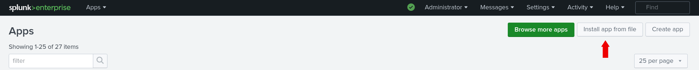
    
3. Select path for IPINFO Splunk app .spl file and Click “Upload”
    
    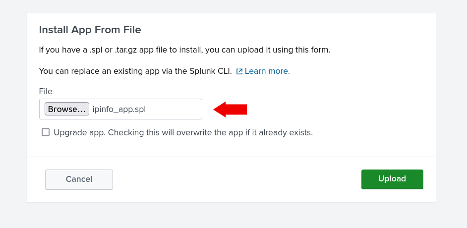
    
4. It is good practice to restart the Splunk, please restart

# Configuration

1. After Installation and restart, login to the Splunk web and go to ‘Manage Apps’
2. It will list out all the installed application and their configuration option.
3. Look for ‘IPINFO and click on the ‘Set-Up’ link to configure the add on.

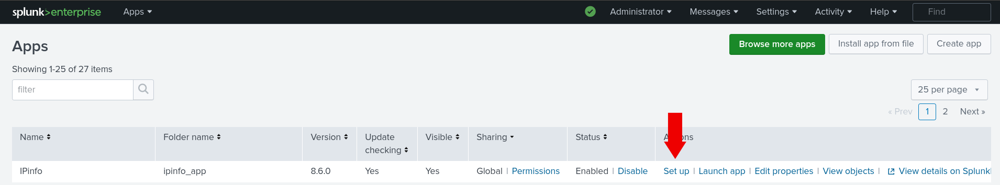

## API Configuration

When configuring the "Rest API" option, the TOKEN field is mandatory, serving as a crucial authentication element for accessing API resources. In contrast, all proxy-related fields are optional, providing flexibility for users who may or may not require proxy settings.

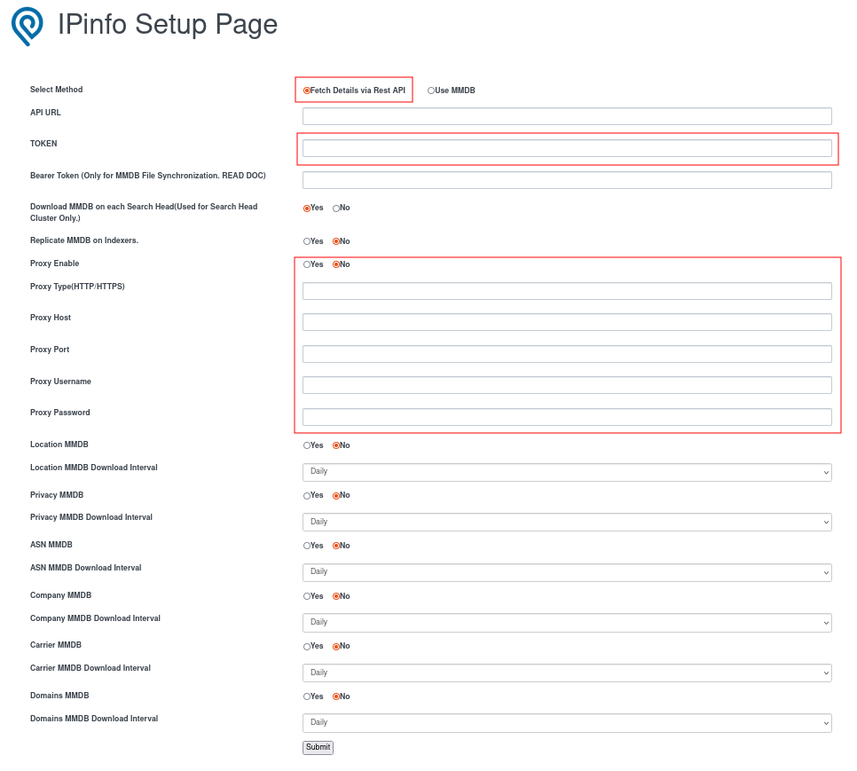

## MMDB Configuration

When configuring the“MMDB” option

- **TOKEN** and **MMDB** related fields will be mandatory fields
- Bearer Token is optional. But it will be used when trying to download MMDB using **Manual Refresh** Dashboard and/or using “**Download MMDB on Each Search Head**” as “**No”**.
- Set “**Download MMDB on Each Search Head**” as “**No**” used when there is a search head cluster and you want to download MMDB from ipinfo.io on only one Search and sync on other search heads and in this case Bearer token is compulsory. And set “**Yes**” when you each Search Head to Download MMDB from IPinfo.io. Recommended “**Yes**”
- All Proxy related fields will be optional fields
- **Bearer Token** and “**Download MMDB on Each Search Head**” will not use for Standalone Search Head.
    
    
    

**NOTE**: MMDB is downloaded in /lookups section of app directory. And does not overwrite splunk’s default MMDB.

### **Pro configurations**

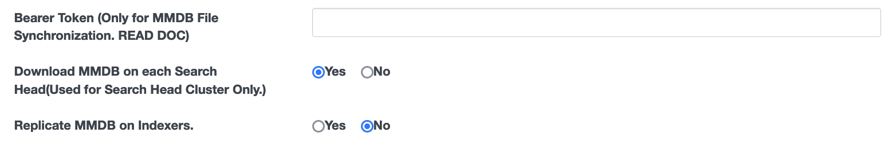

**NOTE**: Do not change the default settings in above section on setup page, unless you know what you are upto.

### **Replicate MMDB on Indexers**

When enabled **YES** will enable replication on MMDB bundle and also make bunch of changes in the code that will enable *ipinfo* to work in streaming more. This is expected to cause performance boost on the query at the expense on increase in bundle size.

This setting is applicable if you using ipinfo app on splunk search head cluster and you have indexer cluster.

### **Download MMDB on each Search Head**

When disabled **NO** will need bearer token to be generated (refer next page) for one search head to download the MMDB files and then replicate on all the other searchheads automatically. This will reduce internet consumption by few gigs while downloading MMDB.

This setting is applicable if you using ipinfo app on splunk search head cluster

### **Steps to get Bearer Token**

1. Go to Settings -> Tokens
2. Click on “New Token” and provide necessary information. And when you click on Create. You will get token value. Just copy that and give as Bearer token in IPinfo.


# Accessing The App


# Test Command

```sql
| makeresults 1 
| eval IP1=random()%192, IP2=random()%210, IP3=random()%230, IP4=random()%192, IP='IP1'.".".'IP2'.".".'IP3'.".".'IP4'
| table _time IP 
| ipinfo IP
```

# Availability of Fields

| Subscription Type | Fields Included |
| --- | --- |
| Location | ip, city, region, country, loc, org, postal, hostname |
| ASN | asn_asn, asn_name, asn_domain, asn_route, asn_type |
| Company | company_name, company_domain, company_type |
| Carrier | carrier_name, carrier_mcc, carrier_mnc |
| Privacy | vpn, proxy, tor, hosting, relay, service |
| Domains |  total_domains, domains |
| Abuse | abuse_address, abuse_country, abuse_name, abuse_email, abuse_network, abuse_phone |

# Different Command

Command: ipinfo

```sql
| makeresults count=2000
| eval IP1=random()%192, IP2=random()%210, IP3=random()%230, IP4=random()%192, IP='IP1'.".".'IP2'.".".'IP3'.".".'IP4'
| table _time IP
| ipinfo IP
```

Command: ipinfo  (Multi)

```sql
| makeresults count=100
| eval IP1=random()%192, IP2=random()%210, IP3=random()%230, IP4=random()%192, SRCIP='IP1'.".".'IP2'.".".'IP3'.".".'IP4'
| eval IP1=random()%192, IP2=random()%210, IP3=random()%230, IP4=random()%192, DESTIP='IP1'.".".'IP2'.".".'IP3'.".".'IP4'
| table _time SRCIP DESTIP
| ipinfo SRCIP DESTIP
```

Command: ipinfo | Flag: prefix

```sql
| makeresults count=100
| eval IP1=random()%192, IP2=random()%210, IP3=random()%230, IP4=random()%192, SRCIP='IP1'.".".'IP2'.".".'IP3'.".".'IP4'
| table _time SRCIP
| ipinfo prefix=true SRCIP
```

Command: ipinfo | Flag: privacy

```sql
| makeresults 
| eval IP="8.8.8.8"
| ipinfo IP privacy=true
```

Command: ipinfo | Flag: asn

```sql
| makeresults 
| eval IP="8.8.8.8"
| ipinfo IP asn=true
```

Command: ipinfo | Flag: company

```sql
| makeresults 
| eval IP="8.8.8.8"
| ipinfo IP company=true
```

Command: ipinfo | Flag: abuse

```sql
| makeresults 
| eval IP="8.8.8.8"
| ipinfo IP abuse=true
```

Command: ipinfo | Flag: domains

```sql
| makeresults 
| eval IP="8.8.8.8"
| ipinfo IP domains=true
```

Command: ipinfo | Flag: carrier

```sql
| makeresults 
| eval IP="1.0.178.0"
| ipinfo IP carrier=true
```

Command: ipinfo | Flag: alltypes

```sql
| makeresults 
| eval IP="1.0.178.0"
| ipinfo IP alltypes=true
```

Command: ipinfobatch

```sql
| ipinfobatch ip="197.94.71.228,197.94.71.227,197.94.71.221 , 197.94.71.226,197.94.71.225 ,197.94.71.22"
```

Command: privacyinfo

```sql
| makeresults | eval IP="23.24.240.0" | privacyinfo IP
```

Command: rangeinfo 

```sql
| makeresults | eval domain="comcast.net" | rangeinfo domain
```

Command:  domaininfo

```sql
| makeresults | eval IP="1.1.1.1" | domaininfo IP
```

**NOTE**: You can add two or more flags in single search query.

# Location Details Dashboard View


# ASN Details Dashboard View


# Company Details Dashboard View


# Domain Details Dashboard View

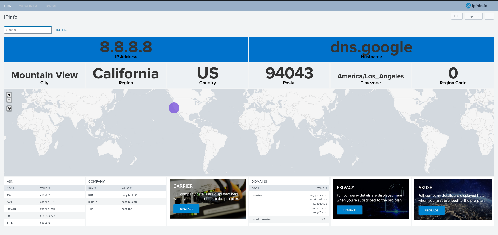

# Privacy Details Dashboard View


# Abuse Details Dashboard View

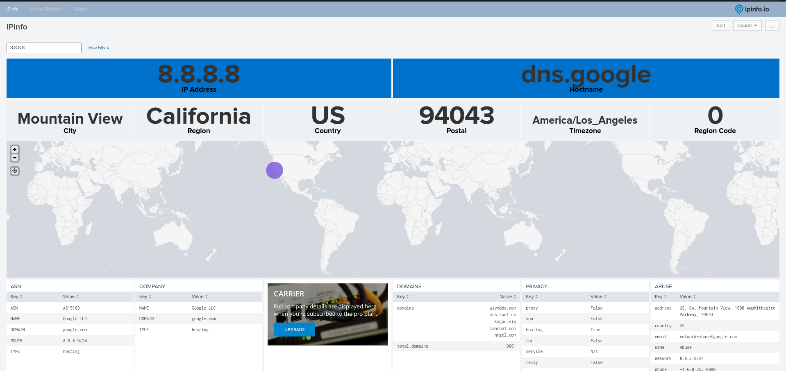

# Carrier Details Dashboard View

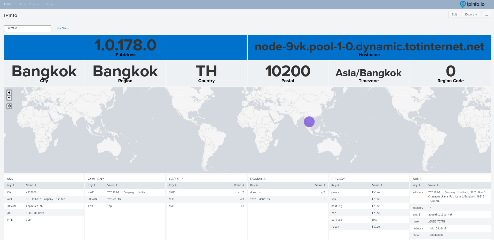

**NOTE**: In instances where subscription data is unavailable for a particular IP or if no subscription is present, an upgrade image will be displayed.

# Workflow Action

From V5.3.1, we have added a new workflow actions in Splunk which will give you option to fetch details of IP from IPInfo by single click. It will work when fieldname is **ip OR *_ip** like **ip,dest_ip,src_ip** etc**.**

**For Example:**


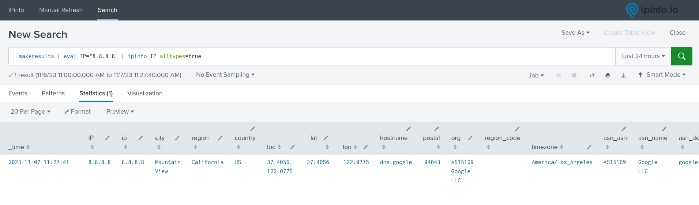

---