# IPinfo Splunk App Installation & Configuration

**Note**: For users with ipinfo_app versions earlier than 8.9.1, please consult the documentation at [ipinfo Splunk Docs (8.9.1)](https://github.com/ipinfo/splunk-docs/tree/8.9.1).

**App Version**: 9.0.0beta1 (see [CHANGELOG](./CHANGELOG.md))

**Author**: IPinfo

**Description**: Installation and Configuration Document for IPInfo App for Splunk

**Latest Update Date**: April 4 2024

# Supported OSes

All Splunk supported OS (Windows, Linux, Mac)

Ref: [https://www.splunk.com/en_us/download/splunk-enterprise.html](https://www.splunk.com/en_us/download/splunk-enterprise.html)

# Supported Splunk Version

| Splunk |
| --- |
| Splunk 9.0.X |
| Splunk 9.1.X |

# Introduction

The IPinfo app provides an integration between IPinfo’s API & DB products and Splunk. This app adds the `ipinfo` command to Splunk, which uses IPinfo data via the API or DBs to lookup IP information for a given IP address.

# Installation

**NOTE**: There are multiple ways of deploying apps to Splunk environment, in this document we’ll be referring installation via CLI (Command Line Interface)

## Case 1: Single Stand Alone Machine (CLI)

Single standalone Splunk Enterprise Installation on Windows/*NIX

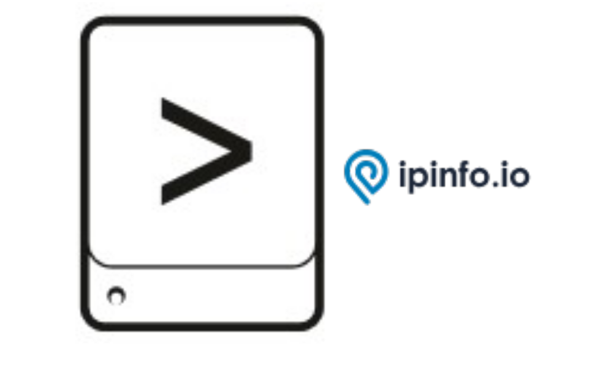

1. **Unzip ipinfo_app.spl**
2. **Copy** the unzipped directory **ipinfo_app** to **$SPLUNK_HOME/etc/apps/**
3. **Open CLI** and restart Splunk using **./splunk restart**

## Case 2: Distributed Architecture

Single Indexer Single Search head and Single forwarder (Heavy or Universal) and Deployment server

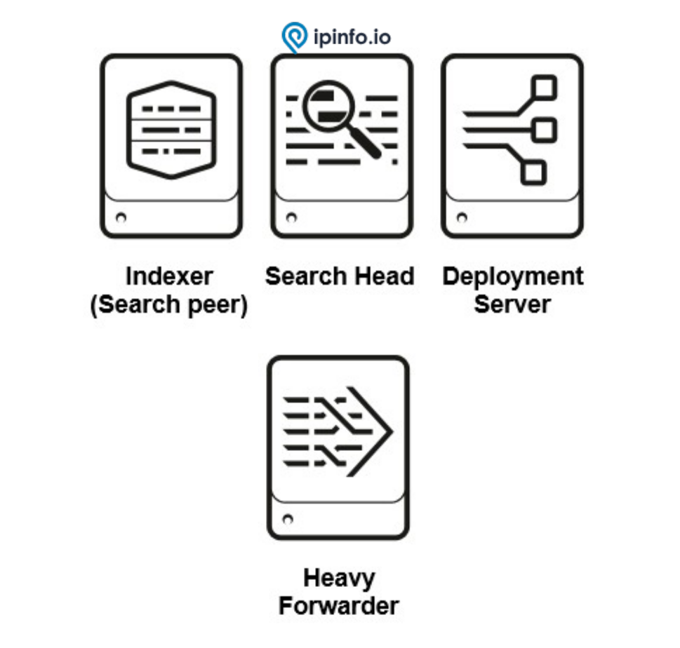

1. **Unzip ipinfo_app.spl**
2. **Copy** the unzipped directory **ipinfo_app** to deployment server in the following location
    
    **$SPLUNK_HOME/etc/deployment-apps/**
    
3. Add following to **serverclass.conf**
    
    ```
    [serverClass:<SEARCHHEAD_SERVERCLASS>:app:< ipinfo_app >]
    stateOnClient=enabled
    restartSplunkd=true
    ```
    
4. **Open CLI** deploy the apps using following command **./splunk reload deploy-server**

## Case 3: Distributed Architecture

Multiple non-clustered Indexers, Multiple non-clustered SearchHeads, Forwarder(Heavy or Universal) and Deployment server

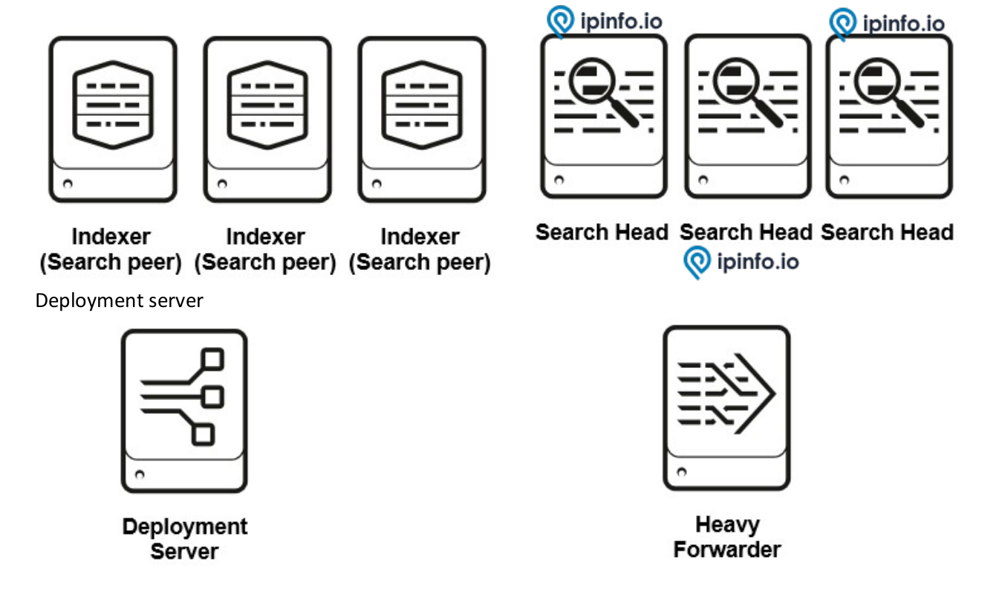

1. **Unzip ipinfo_app.spl**
2. **Copy** the unzipped directory **ipinfo_app** to deployment server in the following location **$SPLUNK_HOME/etc/deployment-apps/**
3. Add following to **serverclass.conf**

    ```
    [serverClass:<SEARCHHEAD_SERVERCLASS>:app:< ipinfo_app >]
    stateOnClient=enabled
    restartSplunkd=true
    ```

4. **Open CLI** deploy the apps using following command **./splunk reload deploy-server**

## Case 4: Distributed Architecture

Single Site clustered Indexer, Clustered Search heads and Forwarder (Heavy or Universal).

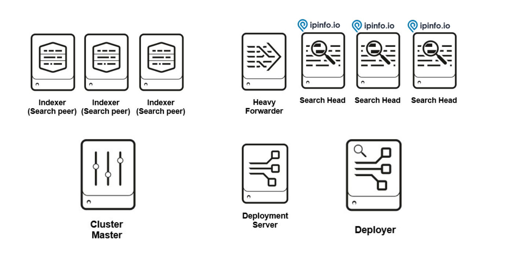

1. **Unzip ipinfo_app.spl**
2. **Copy** **ipinfo_app** to Deployer server in the following location **$SPLUNK_HOME/etc/shcluster/apps/**
3. **Open CLI** on Deployer and deploy the app on Search Head Cluster using following command
    
    ```
    ./splunk apply shcluster-bundle -target <URI>:<management_port> -auth
    
    <username>:<password>
    ```
    

## Case 5: Standalone Installation (WEB)

1. On the Splunk Home Page, Click on “Manage”
    

    
2. On the Manage Apps page, Click on “Install app from file”
    

    
3. Select path for IPINFO Splunk app .spl file and Click “Upload”
    

    
4. It is good practice to restart the Splunk, please restart

# Configuration

1. After Installation and restart, login to the Splunk web and go to ‘Manage’
2. It will list out all the installed application and their configuration option.
3. Look for ‘IPINFO and click on the ‘Set-Up’ link to configure the add on.
4. Make Sure to restart Splunk Instance after setting up the app. In the case of the Search Head Cluster, each search needs to be restarted or a rolling restart must be initiated to make all changes work properly.


## API Configuration

When setting up the "Rest API" option, the TOKEN field is required as it serves as a vital authentication element for accessing API resources. After pressing the Next button, the second step,  **Source Setting**(related to MMDB) will be skipped. In contrast, all proxy-related fields are optional, providing flexibility for users who may or may not require proxy settings.

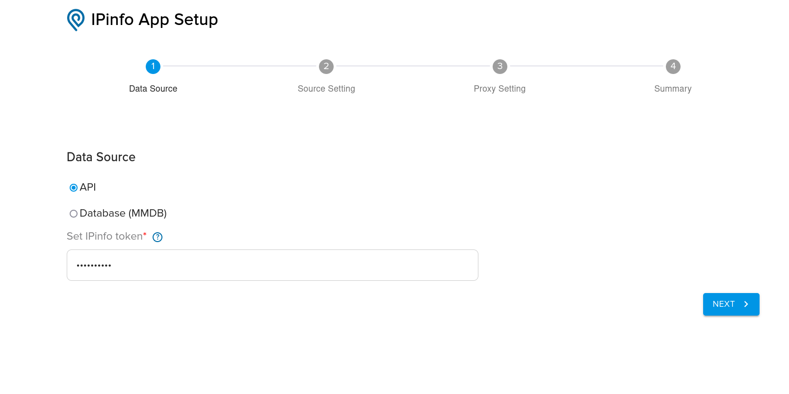


### Summary Page

- With Proxy Setting:
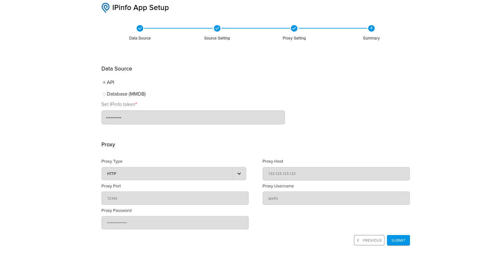

- Without Proxy Setting:


## MMDB Configuration

When configuring the `MMDB` option:

- **Data Source:** token field will be mandatory field
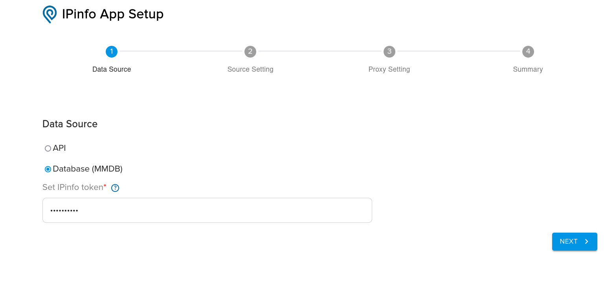

- **Source Setting:** It has the option to enable downloading of available MMDBs at different intervals Daily, Weekly, and Monthly.
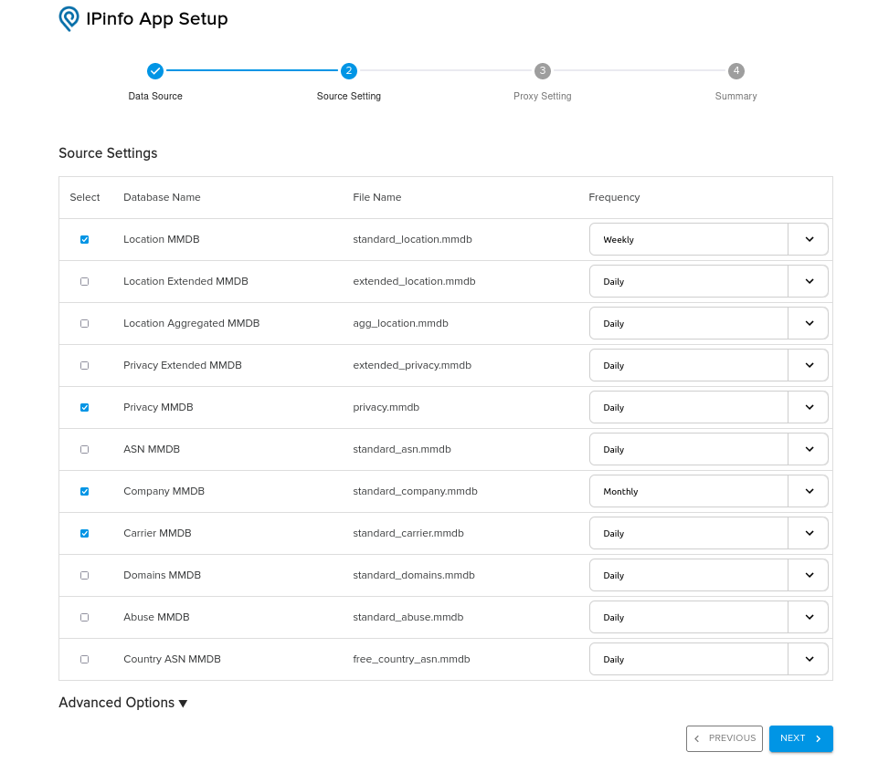

- **Advance Options:** Source Setting page have some advance options they will not use for Standalone Splunk Instance.
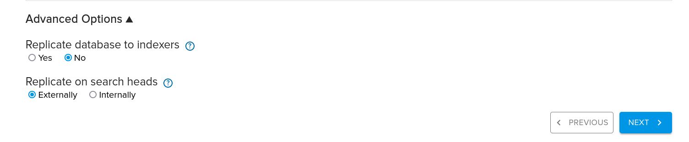

- Set “**Replicate on search heads**” as “**Internally**” used when there is a search head cluster and you want to download MMDB from ipinfo.io on only one Search and sync on other search heads. And set “**Externally**” when you each Search Head to Download MMDB from IPinfo.io. Internally will be a bit slow as compared to externally as it has to copy mmdbs to all search heads.

- Setting "**Replicate database to indexers**" as **YES** will enable replication on MMDB bundle and also make bunch of changes in the code that will enable *ipinfo* to work in streaming more. This is expected to cause performance boost on the query at the expense on increase in bundle size. This setting is applicable if you using ipinfo app on splunk search head cluster and you have indexer cluster.

- **Proxy Setting:** All Proxy related fields will be optional fields

    
### Summary Page
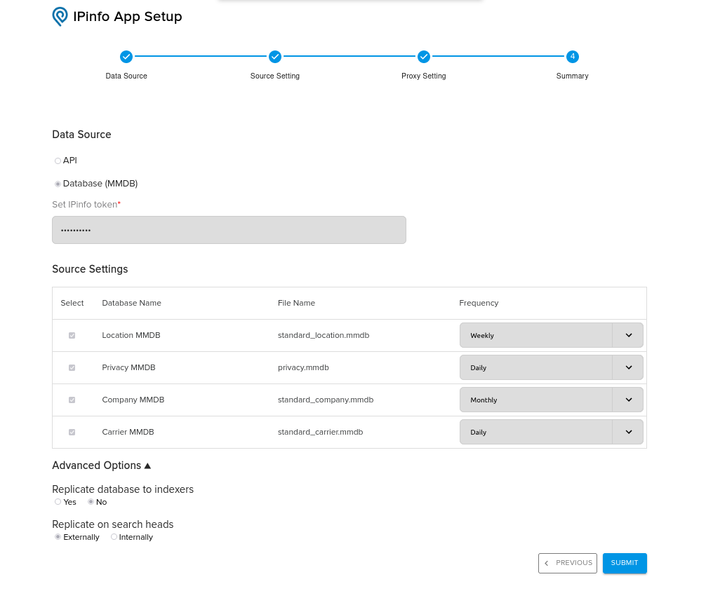
 

**NOTE**: MMDB is downloaded in /lookups section of app directory. And does not overwrite splunk’s default MMDB.

# Usage
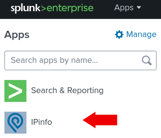

## Fields

| Data Type | Fields Included |
| --- | --- |
| Location | ip, city, country, lat, lon, postal, region, region_code, timezone, geoname_id |
| Location Extended | ip, city, country, country_name, lat, lon, postal, radius, region, region_code, timezone, geoname_id  |
| Location Aggregated | ip, city, country, lat, lon, postal, region, region_code, timezone, geoname_id |
| ASN | asn_asn, asn_name, asn_domain, asn_route, asn_type |
| Company | company_name, company_domain, company_type |
| Carrier | carrier_name, carrier_mcc, carrier_mnc, carrier_cc, carrier_network |
| Privacy | vpn, proxy, tor, hosting, relay, service |
| Privacy Extended | anycast, census, census_port, device_activity, hosting, network, proxy, relay, tor, vpn, vpn_config, vpn_name, whois |
| Domains |  total_domains, domains |
| Abuse | abuse_address, abuse_country, abuse_name, abuse_email, abuse_network, abuse_phone |
| Country ASN | country_asn_domain, country_asn_name, country_asn_asn, country_continent, country_continent_name, country_country, country_country_name |

## Examples

**NOTE**: You can add two or more flags in single search query.

```
| makeresults 1 
| eval IP1=random()%192, IP2=random()%210, IP3=random()%230, IP4=random()%192, IP='IP1'.".".'IP2'.".".'IP3'.".".'IP4'
| table _time IP 
| ipinfo IP
```

### `ipinfo`

```
| makeresults count=2000
| eval IP1=random()%192, IP2=random()%210, IP3=random()%230, IP4=random()%192, IP='IP1'.".".'IP2'.".".'IP3'.".".'IP4'
| table _time IP
| ipinfo IP
```

### `ipinfo` (Multi)

```
| makeresults count=100
| eval IP1=random()%192, IP2=random()%210, IP3=random()%230, IP4=random()%192, SRCIP='IP1'.".".'IP2'.".".'IP3'.".".'IP4'
| eval IP1=random()%192, IP2=random()%210, IP3=random()%230, IP4=random()%192, DESTIP='IP1'.".".'IP2'.".".'IP3'.".".'IP4'
| table _time SRCIP DESTIP
| ipinfo SRCIP DESTIP
```

### `ipinfo` (prefix)

```
| makeresults count=100
| eval IP1=random()%192, IP2=random()%210, IP3=random()%230, IP4=random()%192, SRCIP='IP1'.".".'IP2'.".".'IP3'.".".'IP4'
| table _time SRCIP
| ipinfo prefix=true SRCIP
```

### `ipinfo` (privacy)

```
| makeresults 
| eval IP="8.8.8.8"
| ipinfo IP privacy=true
```

### `ipinfo` (asn)

```
| makeresults 
| eval IP="8.8.8.8"
| ipinfo IP asn=true
```

### `ipinfo` (company)

```
| makeresults 
| eval IP="8.8.8.8"
| ipinfo IP company=true
```

### `ipinfo` (abuse)

```
| makeresults 
| eval IP="8.8.8.8"
| ipinfo IP abuse=true
```

### `ipinfo` (domains)

```
| makeresults 
| eval IP="8.8.8.8"
| ipinfo IP domains=true
```

### `ipinfo` (carrier)

```
| makeresults 
| eval IP="1.0.178.0"
| ipinfo IP carrier=true
```

### `ipinfo` (country_asn)

```
| makeresults 
| eval IP="1.0.178.0"
| ipinfo IP country_asn=true
```

### `ipinfo` (alltypes)

```
| makeresults 
| eval IP="1.0.178.0"
| ipinfo IP alltypes=true
```

### `ipinfo` (restapi)
- To utilize API methods while configuring the MMDB setup.

```
| makeresults 
| eval IP="1.0.178.0"
| ipinfo IP restapi=true
```

### `ipinfo` (restapi with alltypes)

```
| makeresults 
| eval IP="1.0.178.0"
| ipinfo IP restapi=true alltypes=true
```

## Dashboard

### Ipinfo Dashboard View

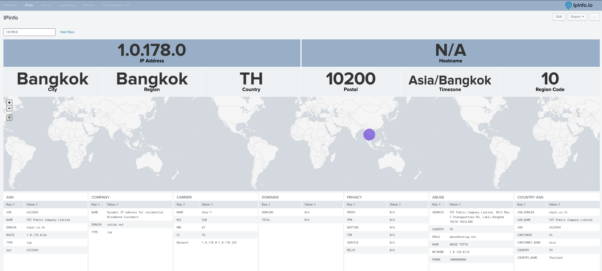

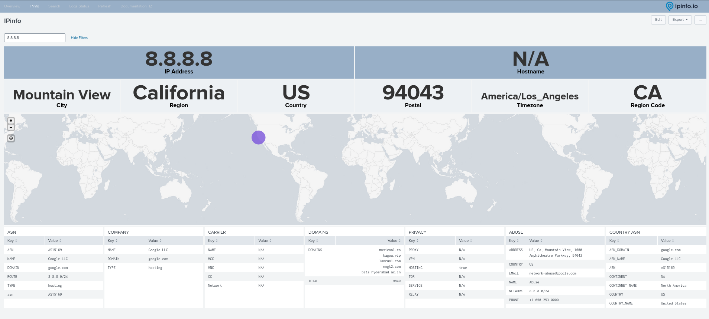

### Overview Dashboard View

- When selected method is 'MMDB'
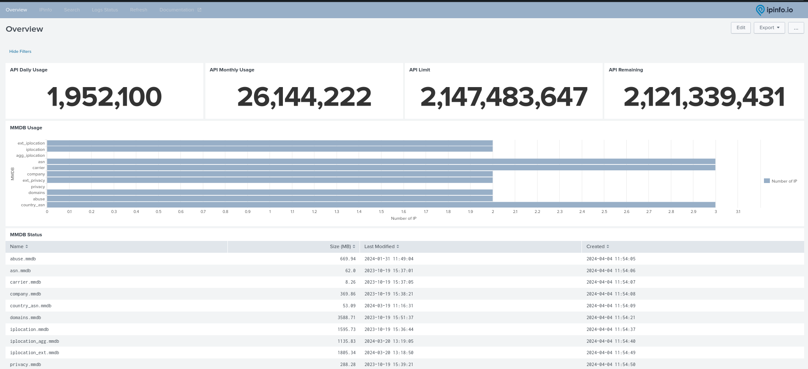

- When selected method is 'API'
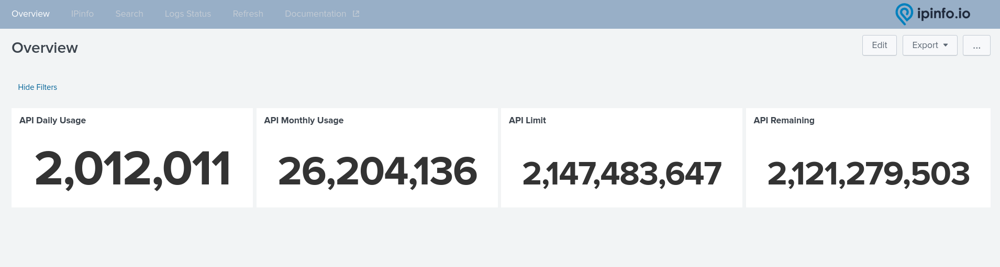

### Refresh Dashboard View

- To force refresh MMDB file at the moment.


### Log Status Dashboard View

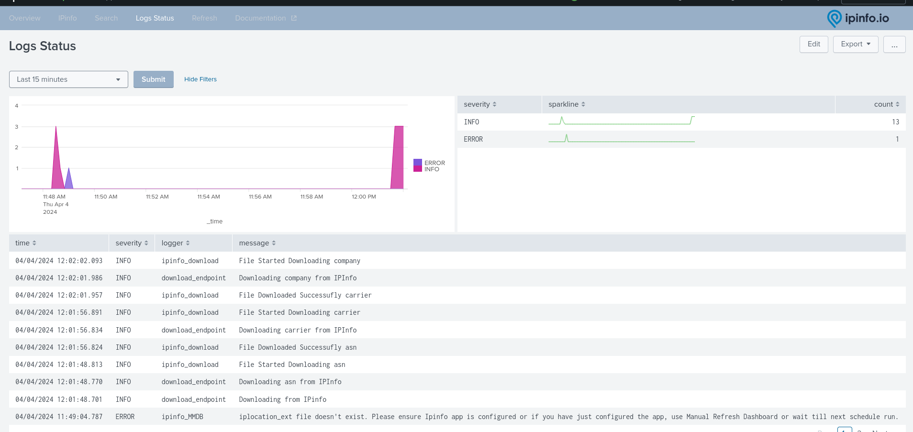


